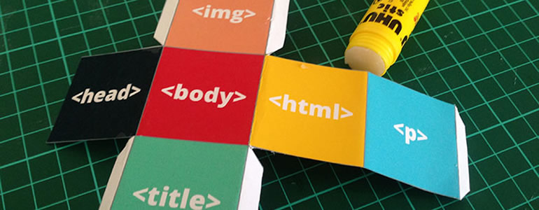

#Design Thinking

## Take Action

## Building Together: The Design Process

"Design thinking" is the practice of solving problems for humans, with other humans. Instead of working with hypothetical arguments or problem sets, learners engage real-world problems and work together on proposed solutions. Education folks might also use the terms [authentic assessments](http://en.wikipedia.org/wiki/Authentic_assessment) or [experiential learning](http://en.wikipedia.org/wiki/Experiential_learning) to describe these kinds of assignments. 

In "Design Challenges" learners select a problem, conduct research with users, prototype a solution, give and receive feedback, and iterate to produce a final project.

[IDEO](http://www.ideo.com/), the innovative design agency, has created a [Design Toolkit](http://www.designthinkingforeducators.com/design-examples/) for Educators which helps teachers co-design solutions with students:

For instance, "Design Thinking Hawaii" collaborated with students at Castle Hill High School in Hawaii to redesign and restructure the high school to solve issues with engagement and learning outcomes.

>Through a series of mini-charettes, Design Thinking Hawaii has collected the needs and interests of learners, teachers, and families and engaged the larger community to imagine new solutions that could help the school be more effective. The adopted plan captured the community’s priorities in new content and structures, and Complex Area Superintendent Lea Albert is enabling the school and community to prototype and iterate core curriculum, character education, and support services. 

-- [Design Thinking for Educators](http://www.designthinkingforeducators.com/design-examples/)

Through the design process, students learn from the community around them and work together on a solution that is relevant to their lives. The web is the perfect medium to prototype solutions to real-world problems.

##Thinking "Out Loud"

There are plenty of activities to get people activated and "thinking out loud". You can encourage brainstorming with [collaborative mindmapping](https://laura.makes.org/thimble/collaborative-mindmapping), [plan webby projects](https://mozteach.makes.org/thimble/designing-for-the-web-planning) with paper and markers, and teach the web in [offline and lo-fi environments](https://keyboardkat.makes.org/thimble/LTIxMDA3NTY0ODA=/lofi-nofi-teaching-kit). 

Help guide your learners by giving them design constraints around a particular topic or theme, and then allow them to define problems within those constraints. Together, you can research, brainstorm and prototype possible solutions to the learner defined problems. Then, have learners gather feedback, iterate and expand on their work.

Encourage a free exchange of ideas, and you'll be surprised at the types of problems learners and makers can collaboratively solve.

## Thinking with Physical Tools

When thinking about participatory learning, we prefer to mix and match all the learning styles together, and to be fair, there's no evidence to suggest that this approach is incorrect. In fact, inherent to learning with media is learning through a variety of methods. Think outside the box when engaging learners. *What methods do you use to spur creativity and excite learners?*

>It's a haptic method to encourage people to talk about different types of participation and how we interrelate. We made the blocks because learners need to critically explore modes of participation, and a game makes that easier. 

--[Peg Koedel, Casablanca Mediahaus](http://casablanca-dresden.de)

Educators and technologists around the world are finding new ways to use participatory learning methods. They are publishing in the open ([download the Wackelturm templates!](https://github.com/edgar-b/Wackelturm)) and collaborating online to spread and improve these methods.

There are lots of ways to #TeachTheWeb, and the community can help you find engaging and interesting physical activities that have been tested in classrooms, libraries and events around the world.  

##Recap
* Encourage collaboration through project based activities
* Help learners define problems to work on by giving them design constraints
* Use haptic methods to encourage critical thought and planning