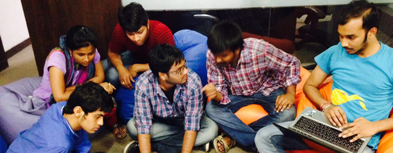

# Facilitating Participation

## Take Action

* **DIY Learning Experience** If you didn't plan and create a lesson plan that embeds web competencies and skills with the learning goals you're most interested in teaching in the Web Literacy module, you should do one now! Start by using [Paper Prototyping](https://stuff.webmaker.org/teach-assets/kits/paper/TeachingKitDesignCanvas.pdf) to organize your thoughts, then try remixing our [Teaching Kit Template](https://thimble.webmaker.org/project/10274/remix?ref=training) to help frame your lesson. Think about what activities you would run. You can search teach.mozilla.org for activities to try or make new activities with the help of the [Activity Template](https://thimble.webmaker.org/project/10286/remix?ref=training).

Publish and share your Teaching Kit with the [Discourse community](http://discourse.webmaker.org/category/training/building), and personally ask 2-3 people to review it for constructive feedback. Be sure to mention them with an @[name] when you post it.

* **Playtest your activities** 
  * **Gather some friends or family** and run through your activities with them. Ask them to be honest about their experience and take note of what goes wrong (and right!)
  * **Collect the resources** your participants made or make a [Storify](http://storify.com) or a [Pinterest board](http://pinterest.com) with relevant quotes, pictures, documents.
  * **Write and share a blog post about your playtesting** experiences or what it was like to facilitate this kind of learning. Post in the [Discourse community](https://discourse.webmaker.org/category/training/facilitating) and ask people to give constructive feedback on your teaching style.
  
  
* **Host an Event** The best way to learn is to teach! Gather a group of learners and get them making and learning together. We have lots of [guides and assets](https://teach.mozilla.org/events/resources/) to help make your event shine. Be sure and [share](http://discourse.webmaker.org) what you're doing with the Community.

## Facilitating = Purpose + Play + Share

As a facilitator, you are designing an event driven by passion, peers and play. So, when putting together an event, we as Mozilla facilitators start with the following principles:

* Purpose: what's the goal of the event? What should people know by the time they leave?
* Mix: how can we get people moving around and talking to each other about the topic at hand?
* Play: how does the next activity bring folks together around their projects of passion?
* Share: how can we have learners present to each other in reflective share-outs during the event?

Part of being a successful mentor, however, is leveling up your teaching skills and working with others across a wide variety of local and global spaces to meet learners where they are. We have cultural understandings of what teaching and learning are <em>supposed</em> to look like, but the open community is actively shifting the dynamics between teachers and learners to create learner-centric experiences. 

Wherever you #TeachTheWeb, you want to plan and execute a <strong>purposeful</strong> event. A successful event might include some - or even a lot - of time for tinkering, but you need to approach the event as something more than an opportunity to tinker. Conversely, you don't want to spend your time talking at people. You need to be clear on what you'll teach, what your users will make, and how your event will empower participants to keep learning and making thereafter.

Mozilla events should be <strong>participatory</strong>, but this doesn't mean that you set your users loose without support. As a mentor, you should work to find that sweet spot between just-in-time teaching (which is sometimes very structured) and putting people in charge of their own learning. Generally, if you can <strong>get your participants moving, talking, and having fun with one another</strong> around your event's big ideas before you introduce any particular webmaking tool or technique, you will have helped your learners activate their prior knowledge about webmaking and set their own reasons for learning.

Finally, plan your event to be <strong>playful</strong>. While our mission is a serious one, the more joy we find in it, the more we'll stick with it and the more people we'll attract to it. <strong>Discovery is a delightful process, and agency is empowering.</strong> Plan your event so that participants finish with something that reflects their learning, as well as their humor or passion. Try to plan events that leave a lot of room for play, peer-teaching between participants, co-learning with you as you help solve problems, and users' decision-making. <strong>If your participants feel like they are at play, they will self-organize their learning to the point that your teaching seems almost magically invisible.</strong> They'll leave saying, 'That was awesome!', as they see how you designed the event to maximize their learning and wrap your teaching in their success.

You don't have to reinvent the wheel (maybe just re-shape it a bit) to run a successful and participatory event. There are plenty of great Mozilla Learning <a href="https://teach.mozilla.org/activities/">teaching kits</a> available that model a progression of participatory activities assembled to #TeachTheWeb. We are each other's teaching and technology mentors, and contributing and remixing teaching activities and kits is one way for us to remain participants in the Mozilla community and mission.

##Recap
* Facilitating means making an event:                           
  * **Participatory:** Engaging and activating participants from the beginning and getting them making and doing, rather than listening and watching.
  * **Purposeful:** Working toward meaningful goals.                                 
  * **Productive:** Well-planned so that concrete outcomes are achieved in the allotted time, and participants feel time was well spent.
* Facilitating and pacing an event is essential to sustaining participant engagement and energy levels.
* The open community is actively shifting the dynamics between teachers and learners to create learner-centric experiences.