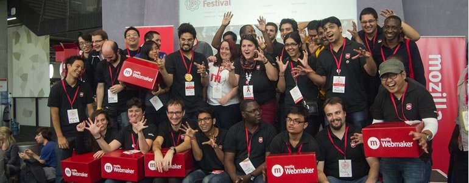

#Encouraging Diversity

##Take Action

* **Practice telling your story.** This is one of the most effective ways to find collaborators. Tell your story to other Mozillians. How do they respond? How do you feel telling it? [Share your reflections.](http://discourse.webmaker.org/category/clubs/stories)
* **Start Recruiting.** Prepare a list of outcomes that people will accomplish by becoming involved. Remix our recruitment spreadsheet template (coming soon!) to track where you're looking for people and any conversations you have with:
  * **Local schools.** Approach nearby colleges, universities or schools and see if any students want to mentor. You might contact teachers in a relevant field directly, or leave signs on message boards.
  * **Co-workers.** Often times the people we work with are eager to assist and learn as well. Send out an email to your office asking if anyone is interested.
  * **Local organizations and tech groups.** There might be an organization or tech group nearby that is looking for ways for their employees or members to get more involved in the community.
  * **Learners.** Ask those who are attending your events if they have a parent, relative or friend who is interested in mentoring. Or maybe they want to become mentors themselves!
  * **Online.** Put a call out for mentors on your website, local forums and social media. You never know where the message will land.
  * **Local Mozillians.** Check [the Mozillians directory.](http://mozillians.org) There are volunteers everywhere.
* **Have a conversation with each potential collaborator.** Talking to someone 1:1 is very powerful. Tell them your story and how they can make a difference. Invite them to run a club or volunteer at your events. Listen to what they want to achieve and ask for help with your planning.

##Participate: Building our Culture

Co-design, networked learning, playtesting and feedback--we invite others to participate in everything we do. As leaders, it’s our responsibility to invite others to make and learn with us. We <3 codesign. Every great event and online activity is well-served by forming a team to bounce ideas off of, distribute responsibilities, and help promote. Working with others is fun and having a diverse community will make your programs, actions and efforts more impactful and sustainable. 

>“Diversity and independence are important because the best decisions are the product of disagreement and contest, not consensus and >compromise.” — James Surowiecki, The Wisdom of Crowds

Diversity isn’t easy, it requires cultivation and intentionality, it can be contentious and uncomfortable, but it is essential for success because it expands our experience and understanding. Diversity challenges us.

Mozilla, P2PU, Wikipedia, YouTube, and Instructables are all "communities of practice". These organizations and businesses work hard to encourage participation and diversity in their cultures. As a network, we can solve large-scale, unique, complicated and new problems together. We can be socially creative, inspire each other and overcome obstacles.

By inviting others to participate, they climb the first rung of the “ladder of engagement.” In our online communities, we all participate at different levels of passion and experience. Scholar Gerard Fischer, in his study of online communities, shows how participation evolves:

Source: Gerhard Fischer, [“Understanding, Fostering, and Supporting Cultures of Participation”](http://l3d.cs.colorado.edu/~gerhard/papers/2011/interactions-coverstory.pdf) 

We all entered this community at different levels of engagement. For example, you might have started out as a learner at a Maker Party or you might have shared a remix and found it retweeted and shared again by the #TeachTheWeb team. As you increased the frequency and depth of your involvement with Mozilla, the Mozilla community increased its engagement with you.

Together, are building our global community, and it is made up of local communities all over the world.

Just as we work to design purposeful, participatory, and fun events for learners, we need to remain connected with one in purposeful, participatory, and fun ways. To connect further with others working for an open Web, and to help others begin this work you might:
* **Learn [GitHub](https://github.com/mozilla/webmaker-curriculum)** and post your curriculum (for makes AND events) there, for developers and educators to 'fork' into their own work. 
* **Talk with local educators in formal spaces** - like schools and libraries - about starting a [Mozilla Club](http://teach.mozilla.org/clubs) with an institutional co-sponsor.
* **Level-up another local contributor** to mentor status and work together to scale up your events from the kitchen table to larger venues like maker spaces or libraries.
* **Push your work into a new place for new audiences** - run a train the trainer event, write an e-book on coding in the classroom or learn how to make an online or print-and-play game that teaches the web.

##Being intentional about diversity
Young people live in a culture of pervasive social inequality, but that does not mean that they are equipped to deal with it. Likewise, although they have spent their entire lives immersed in a glut of information technology, it does not mean that they are equipped to interpret and manipulate it to their needs. We must lead the way.

Change always begins within ourselves. We start by cultivating our own diverse networks. By looking around at our network: in our meetups, in our projects and proposals, or in our social media spaces to ask the hard questions: are we represented by a thoroughly diverse set of people, ideas, experiences, backgrounds and passions? Who is not at the table? How can we welcome them?

We must create an environment that welcomes members of our community who are underrepresented in our work. We must invite diverse perspectives into our work, whether that includes race, geographic location, or subject matter. No, not only invite, we must reach out and make welcome. Again, an invitation is only just that and nothing more.

Individually, online or off, this might mean thinking twice before deciding to un-friend or un-follow someone who challenges us, or to proactively seek out a dissenting opinion, to go out and visit a place we have never been to before, a place that challenges us, to follow the comments of someone who is different than us, to give voice and space to ideas that conflict with our own.

Diverse social networks do not build themselves. Through mentoring and modeling, we can help the next generation cultivate a diverse social network, online and offline. This is not a self-emergent phenomenon, even online.

##Brokering Diverse Relationships
Helping people to cultivate a truly diverse network of peers, mentors, and educators may be one of the most important elements of the work we do. In their 2015 white paper on Brokering Future Learning Opportunities, the Hive Research Lab stated that

>“Youth who have social networks that are more robust and supportive are more successful at accessing social and material resources to meet their needs compared to youth whose networks are less supportive.” 

Among the many insights the Hive Research Lab published in [“On-Ramps, Lane Changes, Detours and Destinations: Building Connected Learning Pathways in Hive NYC through Brokering Future Learning Opportunities”](https://hiveresearchlab.files.wordpress.com/2015/04/hive-research-lab-2015-community-white-paper-brokering-future-learning-opportunities1.pdf), is a helpful graph to help us all integrate brokering strategies into our educational endeavors.

<table>
	<tr>
		<td colspan="2">DURING THE PROGRAM
		</td>
		<td>
		AFTER THE PROGRAM
		</td>
	</tr>
	
	<tr>
		<td>
			<em>At any time...</em>
			<ul>
				<li><strong>Organize field trips</strong> to new settings to meet new people and institutions.</li>
				<li><strong>Share information</strong> about program topic-related events (conferences, lectures, etc.)</li>
				<li><strong>Discuss how engagement</strong> in the program’s activity <strong>can be connected</strong> to school activities, or career or school goals.</li>
				<li><strong>Provide speaking opportunities</strong> for youth to present/share their projects.</li>
			</ul>
		</td>
		<td valign="top">
			<em>Towards the end...</em>
			<ul>
				<li><strong>Debrief with students</strong> and help them identify what they’d like to do next.</li>
				<li><strong>Help youth to apply</strong> or register for an opportunity.</li>
				<li><strong>Encourage youth to stay in contact</strong> with the organization.</li>
				<li><strong>Offer ‘leveling-up’ opportunities</strong> to youth who have completed the program (e.g., co-teach the program, become a ‘student resident,’ etc.). Possibly base this on passion in addition to (or instead of) skill level.</li>
			</ul>
		</td>
		<td>
			<em>Periodically...</em>
			<ul>
				<li><strong>Check in with former youth</strong> participants periodically. Let them know you’re interested in their activities.</li>
				<li><strong>Provide speaking opportunities</strong> for youth to present their projects.</li>
				<li><strong>Schedule 'reunions'</strong> with all youth who participated at a particular program.</li>
				<li><strong>Identify ‘junior leaders’</strong> who are ready to scaffold their leadership roles with younger youth; have them serve as the ‘youth bridges.'
</li>
			</ul>
		</td>
	</tr>
</table>

##Connect
Ultimately, we connect with one another to make this work real. An open Web depends on open societies, and those societies are full of living, breathing people like us who can best latch on to ideas of diversity and freedom when given the chance to see and make things of tangible worth and personal meaning like any number of open source projects around the world. Connecting at a human level, face-to-face and online, low-fi and hi-fi, to help and ask for help - this is what it means to stay connected in an effort to write the Open Web and open societies.

We’ve put theory and practice to the test and seen first hand that shifting dynamic of mentor/learner relationships. It’s time to help each other as we create local communities of practice that tie into a global movement.

##Recap:
* We are building our own participatory culture in the Mozilla community
* Together we can solve large-scale, complex problems
* You can continue to level up through teaching yourself new things, asking others to participate, and sharing your failures, successes and lessons learned
* Encouraging diversity is about intentionality
* Brokering relationships and opportunities for learners is an important practice in open teaching and learning.
