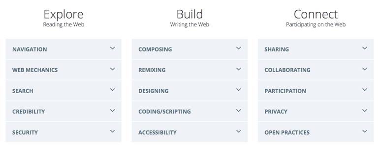

# Web Literacy

##Take Action

* **DIY Learning Experience**: Plan and create a lesson plan that embeds web competencies and skills with the learning goals you're most interested in teaching. Start by using [Paper Prototyping](https://stuff.webmaker.org/teach-assets/kits/paper/TeachingKitDesignCanvas.pdf) to organize your thoughts, then try remixing our [Teaching Kit Template](https://thimble.webmaker.org/project/10274/remix?ref=training) to help frame your lesson. Think about what activities you would run. You can search teach.mozilla.org for activities to try or make new activities with the help of the [Activity Template](https://thimble.webmaker.org/project/10286/remix?ref=training).
		
Think about your plan and what kinds of Web skills learners will develop by completing your activity. Use the [Web Literacy Map](https://teach.mozilla.org/teach-like-mozilla/web-literacy/) as a guide and then make a note of which specific competencies your new resource introduces or deepens.

Make note of which CC License you would like your kit to be under. For help with attributing images and other resources, [check out this thread](http://discourse.webmakerprototypes.org/t/attributing-images/290) or take a course at the [School of Open](http://schoolofopen.org)

Publish and share your Teaching Kit with the [Discourse community](http://discourse.webmakerprototypes.org/category/training/building), and personally ask 2-3 people to review it for constructive feedback. Be sure to mention them with an @[name] when you post it.

* **Curate and Reflect**: Which resources did you consult for your lesson plan? Wikipedia pages? Stack Overflow documentation? Flickr? Collect your resources and make a [Storify](https://storify.com/) or a [Pinterest board](http://www.pinterest.com/) with your relevant quotes, pictures, documents. Share your curated resource and activities with the [Discourse community](http://discourse.webmakerprototypes.org/category/training/building) and ask people to contribute further resources on your idea.

## The Web is for *Making* (not just Consuming)

> "Open Educational Resources (OER) are teaching, learning, and research materials in any medium that reside in the public domain or have been released under an open license that permits their free use and re-purposing by others."

--Hewlett Foundation "[Open Educational Resources](http://www.hewlett.org/programs/education/open-educational-resources)"

Our aim is to continue strengthening this community, sharing experiences and make some hackable, shareable OERs that push the boundaries of participatory, collaborative, learner-centric learning. You can use the included links to go deeper into each of these topics.

When we think of the Web, we tend to think of it as a technical infrastructure and a series of services that allow us to connect with one another and share digital artifacts. Many of us don't often consider the immensity of the true fact of what the Web is:

**The Web is human knowledge documented.**

A very, very large amount of human knowledge. It's not new for human beings to document what we know. We've been doing it since the invention of [tokens at the origin of writing](http://en.wikipedia.org/wiki/History_of_writing_ancient_numbers#Clay_tokens). What is new is the way we need to interact with people and systems to make use of that knowledge. What's new are the types of skills and competencies we need to be able to understand information and each other through these machines. **We have to have certain skills to make sense of it all.**

The [Web Literacy Map][8] is a tool that can help you develop these competencies in learners and nurture participatory learning. We started with the question: **What are the skills, competencies and literacies necessary to read, write and participate on the Web - now and in the future?**

> The Web Literacy Map is a guide to support new pathways, and of course, to find ways for us all to track our impact. That's where the map comes in - we can build consensus around the overall learning objectives and then each chart our course against it.

-- [Doug Belshaw](http://twitter.com/dajbelshaw)

###To recap:

* The Web is a massive, shifting repository of human knowledge.
* We should empower learners to engage this ecosystem *and* make the Web they want to use.
* Mozilla developed the [Web Literacy Map](http://webmaker.org/literacy?ref=training) to help you do just that. 

