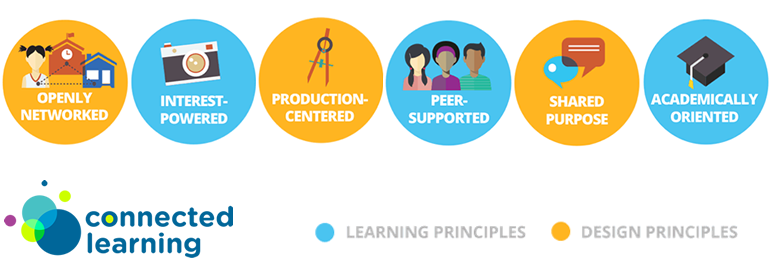

##Connected Learning

Cultural anthropologists and researchers funded by the MacArthur Foundation's Digital Media and Learning Initiative released a new learning model called <a href="http://dmlcentral.net/press/2012-02/researchers-introduce-new-model-learning-connected-learning-designed-‘mine-new-social">“Connected Learning”</a> in the first quarter of 2012 (“Researchers Introduce New Model of Learning, Connected Learning,” 2012). 

This model (see the above image) is based on a large body of research and includes Connected Learning principles and core values.

These principles state that education in the modern world needs to be:

1. **Interest-powered** - the researchers state that “**learners who are interested in what they are learning, achieve higher order learning outcomes.**” (“Connected Learning Principles,” n.d.) Organizations that follow the connected learning principles create programming that allows the learner to explore their own interests.

2. **Peer-supported** – Connected learning also has an element of **socialization as a required function in learning**. Allowing learners to interact with each other and teach each other in various forms of group work helps learners make connections not only with the materials they're learning, but with their peers as well. Creating learning spaces where peer to peer learning is encouraged leads to deeper cultural exploration and understanding.

3. **Academically oriented** - The third principle proposed by the Connected Learning Model proposes that **academic success is an important underpinning for intellectual growth**.

There are a variety of networks that seek to put these principles and values into practice.  Connected Learning is an innovative way of creating peer groups from different parts of world for the sake of learning &amp; sharing knowledge, so all over the world groups of people and organizations are beginning to use the model to help them design learning opportunities for their local communities.

In practice, it would seem that both hyper-local aspects as well as global connections play an important role in Connected Learning.
