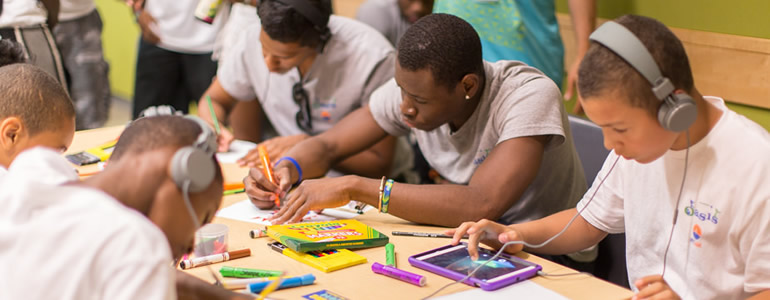

#Making is Learning

##Take Action

* **Find your spirit topic**: Passion + Web + You = Learning! What are you personally passionate about? Is it existentialist philosophy, the cosmos, privacy, baking scones? [Remix a Comic](https://webmaker.makes.org/thimble/create-your-own-comic-a-starter-make) to explain the basics of your passion. Or, use the [Mighty Jupiter](https://chadsansing.makes.org/thimble/webmaker-planet) template to share basic facts about your area of expertise. Share your make(s) with the [community](http://discourse.webmaker.org/category/training/building) and **think about sharing your passion with Club participants**.

* **Create a learner profile**: Ok, you're passionate about something, who else can you think of that is passionate about that same topic?   [Make a profile for your ideal learner.](https://laura.makes.org/thimble/making-learner-profiles) Ask yourself things like *How old are my learners? Do they have a particular career path? What are their hobbies? What's the value proposition to them?*

* **DIY Learning Experience**: Plan and create a lesson plan that embeds web competencies and skills with the learning goals you're most interested in teaching. Start by using [Paper Prototyping](https://stuff.webmaker.org/teach-assets/kits/paper/TeachingKitDesignCanvas.pdf) to organize your thoughts, then try remixing our [Teaching Kit Template](https://thimble.webmaker.org/project/10274/remix?ref=training) to help frame your lesson. Think about what activities you would run. You can search teach.mozilla.org for activities to try or make new activities with the help of the [Activity Template](https://thimble.webmaker.org/project/10286/remix?ref=training).
		
	Think about your plan and what kinds of Web skills learners will develop by completing your activity. Use the [Web Literacy Map](https://teach.mozilla.org/teach-like-mozilla/web-literacy/) as a guide and then make a note of which specific competencies your new resource introduces or deepens.

	Make note of which CC License you would like your kit to be under. For help with attributing images and other resources, [check out this thread](http://discourse.webmaker.org/t/attributing-images/290) or take a course at the [School of Open](http://schoolofopen.org)

	Publish and share your Teaching Kit with the [Discourse community](http://discourse.webmaker.org/category/training/building), and personally ask 2-3 people to review it for constructive feedback. Be sure to mention them with an @[name] when you post it.

* **Curate and Reflect**: Which resources did you consult for your lesson plan? Wikipedia pages? Stack Overflow documentation? Flickr? Collect your resources and make a [Storify](https://storify.com/) or a [Pinterest board](http://www.pinterest.com/) with your relevant quotes, pictures, documents. Share your curated resource and activities with the [community](http://discourse.webmaker.org/category/training/building) and ask people to contribute further resources on your idea.