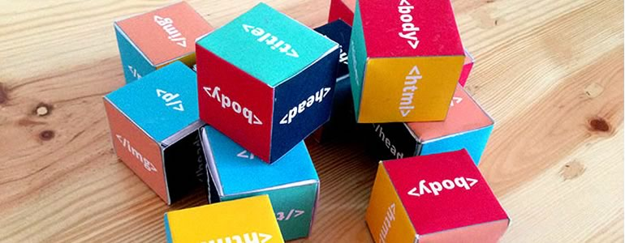

##We are all makers. 

<a href="https://twitter.com/yofiesetiawan">

We cook, sew, construct, write, play music, tinker, paint, tell stories. We engage in our world through the creation of thousands of artifacts that allow others to understand our outlooks and world views. **We express ourselves through creation.** We always have. And in all of our making we express ourselves and then we reflect on what we've created. **We share our creations with others and we ask for feedback.** “Do you like my new recipe?” “What do you think of my painting?”

Throughout our process, we learn. It is through trial and error and the ever important failure that we learn what to do and what not to do. Learning to make something work involves discovery and wonder - it's a spiral of <a href="http://en.wikipedia.org/wiki/Motivation#Intrinsic_and_extrinsic_motivation">intrinsic motivation</a>; each new understanding unlocks new questions. We improve our skills as we create.

In the Making as Learning Movement, networks like <a href="http://teach.mozilla.org">Mozilla Learning</a>, the <a href="http://explorecreateshare.org">Hive Learning Networks</a>, <a href="https://twitter.com/make2learn">Make to Learn</a>, the <a href="http://digitalis.nwp.org">National Writing Project</a> and many, many more are integrating interested-based, hands on activities into their lesson plans and programming to focus more squarely on each learner's needs and building community in the process. These networks are experimenting with changing the power dynamic between teacher and learner, instead forming networks of peers, and using the idea of mentorship to level up competencies, both in the “learner” as well as the “teacher”.