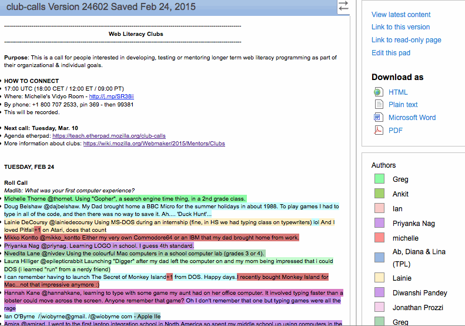

## It's not just about the tools

Open is doesn't mean just using sharing tools like github or twitter -- it's a frame of mind for both practical market success and long-term mission success. It enables local decision-making and provides mechanisms for collaboration. Being open means that you are open to letting other people have an opinion about your work. It means you are empathetic towards those varying perspectives and that you strive to give everyone an equal voice. This can be challenging sometimes because depending on what you're working on, you might feel like there are "too many cooks in the kitchen". 

Community management and conflict resolution go hand in hand with working openly, but as we've said before, Mozilla believes that open is our default setting. We strive to practice the tenets of open in all the things we do. The [How to Work Open article](http://openmatt.org/2011/04/06/how-to-work-open/) from [OpenMatt](http://twitter.com/openmatt) is another great starter read on *why you should work openly*.

The open community uses tons of different tools to get things done. What follows are some details about the most popular tools used in the Mozilla community.

## Open Tools

Part of what makes the open community unique is a unique way of working. [Mozilla](http://mozilla.org) is committed to open not only at the level of technology, but also in terms of how we work  -- for decision-making, discussion, working on specific tasks and bugs, communications and community. It's a defining part of our culture and history. 

The open community uses tons of different tools to get things done. The [How to Work Open article](http://openmatt.org/2011/04/06/how-to-work-open/) from [OpenMatt](http://twitter.com/openmatt) is a great starter read on *why you should work openly*, and this module details some of the most popular tools used in the Mozilla community.

## Etherpad

### What it is
Collaborative document writing/editing with chat
### Setup 
Go to http://etherpad.mozilla.org
### Tips and Tricks
Go to etherpad.mozilla.org/TYPE-THE-NAME-YOUWANT and give your Etherpad a memorable name. As with all online tools, the lack of connectivity can affect Etherpads ability to function properly! At the end of a large collaborative writing session, export your pad just so you have a hard copy, you know just in case.
### Watch out for the spinning beachball of death. 
Sometimes if you copy and paste a body of text into Etherpad, a hidden character will cause the pad to fail. If the etherpad won’t load for people you try to share it with, this is likely the cause. It’s an annoying bug (and we’re working to fix it).
### Ideas for Interactive Homework
Since Etherpad allows multiple people to type at once, and records each persons contribution as a color, it’s a great tool for both the development of group work as well as assessment of individual contributions. Have students collaboratively write a research paper, script or synopsis.
### Super Awesome Feature
The time slider. Watch the evolution of a particular Etherpad by scrubbing the time slider!

## IRC (Internet Relay Chat)
### What it is
Invented before the web, IRC is like a chat program, but cooler.
### Setup 
This video will help you understand the power of IRC, and the [Mozilla IRC resource](https://wiki.mozilla.org/IRC) has all the background you need to get set up.

<iframe src='https://laura.makes.org/popcorn/dhp_' width='640' height='403' frameborder='0' mozallowfullscreen webkitallowfullscreen allowfullscreen></iframe>
 
### Tips and Tricks
Type /msg and a user name followed by a message and you'll send a private message to whomever has that user name. You can also use IRC as a backchannel when in meetings to ask questions or clarify the speaker's points.
### Watch out for too many channels. 
In IRC you can be in a zillion different channels at the same time. It can get overwhelming!
### Ideas for Interactive Homework
Encourage learners to use IRC to share URLs and animated gifs while working on their projects. It's a quick and easy way to share information, and most IRC programs automatically log conversations, so you can prepare discussion topics, run an online discussion and then use the log to assess participation.
### Super Awesome Feature
Type /me followed by a message and your message will be printed as a sort of "thought". 

## HTMLpad
### What it is 
Collaborative HTML writing/editing with chat
### Setup
Go to http://htmlpad.org
### Tips and Tricks
Go to htmlpad.org/TYPE-THE-NAME-YOU-WANT and give your HTMLpad a memorable name. As with all online tools, the lack of connectivity can affect HTMLpad ability to function properly! At the end of a large collaborative coding session, export your pad just so you have a hard copy, you know just in case.
### Watch out for the learning curve. 
HTMLpad is for writing HTML collaboratively. It’s an awesome tool, but after you’ve got your page, you’ll probably want to upload the code to your own server. Learn more about coding, servers and ftp at http://p2pu.org/en/schools/school-of-webcraft/sets/webmaking-101/
### Ideas for Interactive Homework
Have students collaborate to create a simple webpage for your topic.
### Super Awesome Feature
The time slider. The time slider. Watch the evolution of collaborative coding by scrubbing the time slider!

## Wordpress
### What it is
A content management system that can do almost anything.
### Setup
You can set everything up for free at http://wordpress.com
### Tips and Tricks
Choose Appearance>Themes and search the thousands of themes to create a beautiful Wordpress site that works for you. Check out http://codex.wordpress.org/WordPress_Lessons to learn about wordpress.
### Watch out for Plugins when you've installed WP on your own server. 
There are thousands of Wordpress plugins that allow you to do everything from setting up an online store to auto tweeting a message at a given time. Plugins are awesome, you should try them out, love them, use them. Just be aware that some plugins conflict with each other. If you install a plugin and your Wordpress starts acting funny, you’re probably experiencing this kind of conflict. Deactiviate plugins one by one and find the culprit! Wordpress is a robust framework. It’s fairly intuitive, but to harness the power of Wordpress, you should really make a commitment to learning it. Take your time, practice, learn together with your students, and know that there are TONS of tutorials out there.
###Ideas for Interactive Homework
Wordpress can serve you and your students in a million different ways. Using wordpress can allow you to store lesson plans, exercises, ideas, student work, etc to be accessible to anyone anywhere anytime. Don’t want to/can’t have a public site? No problem, with Wordpress you can also have private sites that users log into. Students can interact with each other over the site, trade ideas, images, videos, etc. Wordpress can serve as the infrastructure for entire course.
### Super Awesome Feature
Impossible to list one. So much awesomeness in this free, open source tool.

## Google Docs
### What it is
Collaborative documents, presentations and spreadsheets right in the browser
### Setup
Go to http://documents.google.com. Click “Create New Document”.
### Tips and Tricks
Google Docs is like Office in your browser, you can format text, insert images, draw diagrams.
### Watch out for having to log in. 
To give access to your students, without them having to log in, you’ll have to make the document editable to the public. Make sure you back up important documents!
### Ideas for Interactive Homework
Have students collaborate to create a presentation using Googles presentation tools

## Skype
### What it is
Internet Phone service and Video Chat Client
### Setup
Go to http://skype.com and download the Skype Client. Choose a skype name and password and then search for your students or colleagues and add them as contacts
### Tips and Tricks
Choose Chat>Add People to have a multiperson chat.
### Watch out for faulty connections. 
Every once in a while some wires get crossed and the people you’re trying to talk to sound like they’re living in a bubbleverse. Hang up, try again, usually the problem corrects itself.
### Ideas for Interactive Homework
Skype is a great way to have an online discussion. Have a conference call with your students to check in on how they’re doing with a project. Have one on one meetings to discuss group dynamics. Use Skype to show and tell ideas. Suggest Skype for communication during group projects. Combine a Skype Conference call and an Etherpad and take notes of the call.