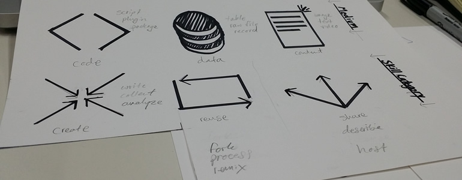

# Remixing for Context (Making it Relevant)

##Take Action
* **Decide who you want to serve.** If you've worked through the Making IS Learning module, you've already thought about the learners you ultimately want to benefit. What do learners need and what can you do for them? [Share your learner profile.](http://discourse.webmaker.org/category/training/building)
* Using your insights to you learners’ aspirations, **remix lesson plans** to speak to individual audiences. The Web Literacy module introduces this concept, but read on for more guidance on how you can change an activity or resource to better suit your learners and your context.
* **Choose a date and publish an invitation** for your event. Meet in-person. Make sure you have a chance to meet with your peers to establish your club. Discuss the remixed curriculum, what the schedule will look like and what parts of the learning will need the most support. Each team member should know what is expected of them so they are poised to give their best effort.
* **Meet Online.** Using open tools you can set up regular checkins and share outs. [The global community meets in calls regularly](https://www.google.com/calendar/embed?src=zythepsary.com_q6ugl9iepetabcp9eg9ltmruic%40group.calendar.google.com&ctz=Europe/London), join us and share what your local community is working on.