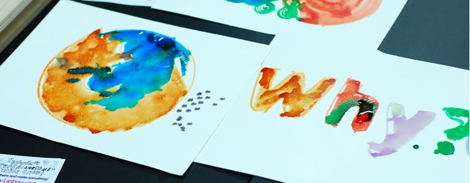

## Why remix?

The first question is, what do we mean by 'remix'? As we define in the Glossary, to 'remix' something is to take something that exists and make something new out of it. This can be a small change, or you could transform it beyond all recognition.

Context is extremely important to learners, especially if they're showing up for something that isn't compulsory. An easy way to make something fun and exciting is to remix it in order to make it applicable to their everyday lives - or something they care deeply about.

Remixing other people's work also allows you to make it better. You can stand on the shoulders of others who are interested in similar outcomes to you. Instead of starting from scratch, you can get a head-start by using and building upon their work.