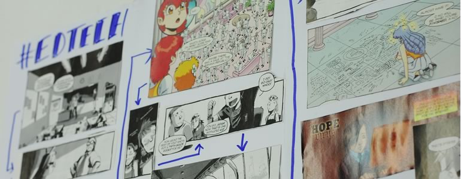

## Global Networking

Online and face-to-face maker communities amplify each other's work and the work of their participants. By sharing what we do in the offline world with our networks in the online world (and vice versa), we create resources, examples and case studies that can help us identify which methods work and how we, as a global community, can support one another.

Until learning web skills, openness and learner-centric methods are inherent in our educational systems, until collaboration and connectivity are integral parts of our learning pathways, until we can recognize learning no matter where it happens, until people all over the world can read, write to and think critically about information in the global knowledge ecosystem that is the World Wide Web – our work is not done. We can't expect that someone else, some other organization, some other community to change the world for us. WE have to make commitments to ourselves and each other that we will spread web skills, the open ethos and maker culture in our communities in whatever ways we can.